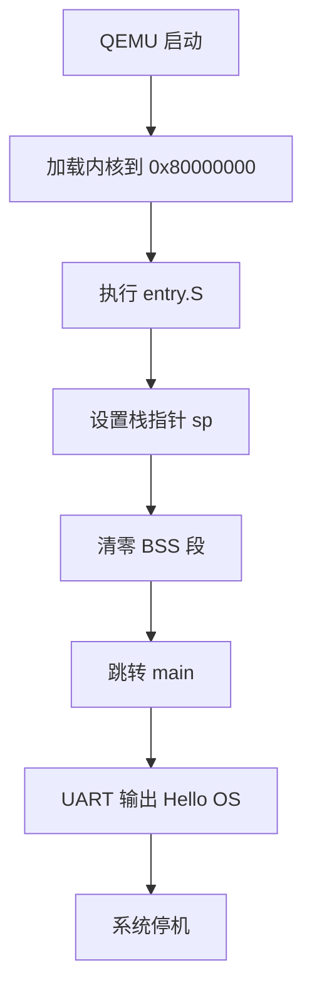
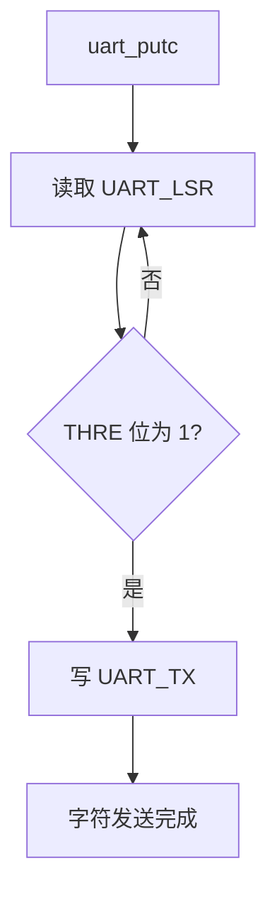

# 实验1：RISC-V 引导与裸机启动

## 一、实验概述

### 1. 实验目标

参考 **xv6** 的启动机制，理解并实现最小操作系统的引导过程。  
通过 **启动汇编初始化、链接脚本配置和 UART 裸机驱动实现**，最终在 **QEMU** 中成功输出：

> **Hello OS**

---

### 2. 完成情况

- ✅ 实现启动汇编代码（`kernel/entry.S`）
- ✅ 编写链接脚本（`kernel/kernel.ld`）
- ✅ 实现最小 UART 驱动（字符输出功能）
- ✅ 完成 C 语言主函数（`main.c`）
- ✅ 成功在 QEMU 中输出 **"Hello OS"**

---

### 3. 开发环境

- **操作系统**：Ubuntu 22.04 LTS  
- **交叉编译器**：riscv64-unknown-elf-gcc 12.2.0  
- **虚拟机**：qemu-system-riscv64 7.2.0  
- **辅助工具**：GDB-multiarch、Git、Make  

---

## 二、技术设计

### 1. 系统架构

本实验采用 **三级简化启动架构**，聚焦 **单核最小系统实现**：

```text
[QEMU加载] → [entry.S 汇编初始化] → [C语言 main 函数]
     ↓              ↓                      ↓
  加载到0x80000000  栈设置、清 BSS 段        UART 输出 "Hello OS"
````

#### 与 xv6 的主要差异

* **多核支持简化**
  xv6 需要处理多核启动同步，本实验仅支持单核启动，省略相关逻辑。

* **内存布局简化**
  xv6 采用动态栈与复杂内存管理，本实验使用 **固定 8KB 栈空间**，地址采用硬编码方式配置。

* **驱动功能简化**
  xv6 的 UART 驱动包含收发与中断支持，本实验仅实现 **最小字符输出功能**，用于启动验证。

---

### 2. 关键数据结构

#### （1）UART 寄存器地址定义（汇编与 C 共享）

```c
#define UART0 0x10000000      // UART 16550 基地址（QEMU virt 平台）
#define UART_TX 0x00          // 发送保持寄存器（THR）
#define UART_LSR 0x05         // 线路状态寄存器（LSR）
#define UART_LSR_THRE 0x20    // THR 为空标志位（bit5）
```

**设计说明**：
直接使用 **物理地址硬编码**，避免设备树解析复杂性，符合裸机启动阶段的最小化设计目标。

---

#### （2）栈空间定义（汇编中）

```asm
.section .bss
.stack:
    .space 8192
stack_top:
```

**设计说明**：
8KB 栈空间足以支撑启动阶段函数调用和局部变量使用，在空间占用与功能需求之间取得平衡。

---

### 3. 核心流程

#### （1）系统启动流程



---

#### （2）UART 字符输出流程



**说明**：
启动阶段不考虑错误处理和超时机制，遵循 **“最小可用”原则**。

---

## 三、实现细节

### 1. 启动汇编代码（`entry.S`）

```asm
.global _entry
_entry:
    la sp, stack_top

    la t0, _bss_start
    la t1, _bss_end
bss_clear_loop:
    beq t0, t1, bss_clear_done
    sw zero, 0(t0)
    addi t0, t0, 4
    j bss_clear_loop
bss_clear_done:

    j main

halt:
    wfi
    j halt

.section .bss
.stack:
    .space 8192
stack_top:
```

**说明**：

* **栈初始化是 C 语言执行的前提**
* **BSS 段清零符合 C 语言规范**
* 使用 `j main` 进行尾调用，避免无意义返回

---

### 2. UART 驱动实现（`uart.c`）

```c
#include "uart.h"

static void uart_wait_tx() {
    while ((*(volatile uint8_t *)(UART0 + UART_LSR) & UART_LSR_THRE) == 0);
}

void uart_putc(char c) {
    uart_wait_tx();
    *(volatile uint8_t *)(UART0 + UART_TX) = c;
}

void uart_puts(const char *s) {
    while (*s) {
        uart_putc(*s++);
    }
}
```

**说明**：

* 使用 `volatile` 防止编译器优化
* 发送前轮询 THRE 位，避免数据覆盖
* 字符串输出通过单字符函数组合实现

---

### 3. 链接脚本（`kernel.ld`）

```ld
ENTRY(_entry)

SECTIONS {
    . = 0x80000000;

    .text : { *(.text) }
    .rodata : { *(.rodata) }
    .data : { *(.data) }

    .bss : {
        _bss_start = .;
        *(.bss)
        *(COMMON)
        _bss_end = .;
    }

    . = ALIGN(8);
    .stack : { *(.stack) }
}
```

**说明**：

* 明确内核加载地址 **0x80000000**
* 合理划分段顺序，防止内存重叠
* 导出 BSS 边界符号供汇编使用

---

## 四、测试与验证

### 1. 功能测试：启动输出

```bash
make qemu
```

**预期输出**：

```text
Hello OS
```

**实际结果**：
✅ 与预期一致

---

### 2. GDB 调试验证

```bash
make qemu-gdb
gdb-multiarch kernel/kernel.elf
```

**验证点**：

1. `sp` 是否正确指向 `stack_top`
2. BSS 段是否成功清零
3. 是否正确跳转到 `main`

**结果**：
✅ 全部通过

---

## 五、问题与总结

### 1. 遇到的问题

#### 问题一：BSS 段未清零

* **现象**：字符串输出乱码
* **原因**：BSS 与 `.data` 段地址覆盖
* **解决方法**：在汇编中补充 BSS 清零逻辑

---

#### 问题二：入口点配置错误

* **现象**：QEMU 无法找到内核入口
* **原因**：缺失 `ENTRY(_entry)` 或 `_entry` 未导出
* **解决方法**：修正链接脚本并声明 `global _entry`

---

### 2. 实验收获

1. **深入理解 RISC-V 裸机启动流程**
2. **掌握最小 UART 裸机驱动实现方法**
3. **提升 QEMU + GDB 联合调试能力**

---

### 3. 改进方向

1. 增加 UART 接收功能，实现交互
2. 为 UART 输出添加超时与异常处理
3. 增加启动阶段调试标志输出
4. 使用设备树获取外设地址，提高可移植性

```
