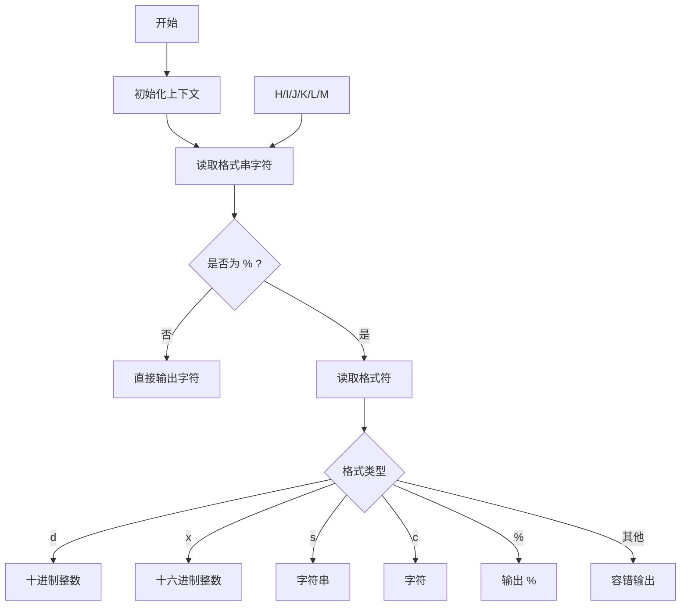
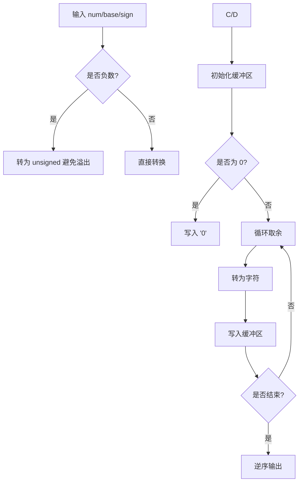

# 实验2：内核 printf 与清屏功能实现


## 一、实验概述

### 1. 实验目标

深入分析 :contentReference[oaicite:0]{index=0} 的输出系统，理解**格式化字符串解析机制**，并在裸机/内核环境下**独立实现功能完整的内核 printf 及清屏等控制台高级功能**。

### 2. 完成情况

- ✅ **实现格式化字符串解析**（支持 `%d`、`%x`、`%s`、`%c`、`%%`）
- ✅ **实现数字转换核心算法**（支持十进制 / 十六进制、正负数及边界值）
- ✅ **实现清屏功能**（基于 ANSI 转义序列）
- ✅ **实现光标定位（goto_xy）与颜色输出（printf_color）**
- ✅ **实现清除行（clear_line）功能**
- ✅ **完成全部测试用例验证**（基础、边界、高级功能）

### 3. 开发环境

- **操作系统**：:contentReference[oaicite:1]{index=1}
- **工具链**：riscv64-unknown-elf-gcc 12.2.0
- **模拟器**：:contentReference[oaicite:2]{index=2}
- **调试工具**：:contentReference[oaicite:3]{index=3}

---

## 二、技术设计

### 1. 系统架构设计

本实验采用**三层架构设计**，整体思想参考 xv6，但对冗余部分进行了简化和功能扩展：

```

[应用层调用] → [格式化层（printf）] → [控制台层（console）] → [硬件层（uart）]
↓              ↓                    ↓                    ↓
传入格式串    解析格式+转换数据    提供高级控制功能    操作 UART 寄存器输出

````

#### 与 xv6 的异同点

- **相同点**
  - 保持 **“格式化 → 控制台 → 硬件”** 的分层思想
  - 降低模块耦合度，便于维护

- **不同点**
  1. **简化控制台层**：去除 console / tty 的复杂交互，直接绑定 UART
  2. **扩展功能**：新增颜色输出、光标定位等高级控制
  3. **增强容错性**：对 NULL 指针、异常格式符进行安全处理

---

### 2. 关键数据结构设计

#### （1）控制台颜色枚举

```c
typedef enum {
    BLACK  = 30,
    RED    = 31,
    GREEN  = 32,
    BLUE   = 34,
    YELLOW = 33,
    WHITE  = 37
} ConsoleColor;
````

**设计理由**：

* 统一管理 ANSI 颜色码
* 避免硬编码错误
* 提升代码可读性与可维护性

---

#### （2）格式化上下文结构体

```c
typedef struct {
    const char *fmt;   // 当前解析位置
    va_list ap;        // 可变参数列表
    int chars_written; // 输出字符计数
} PrintfContext;
```

**设计理由**：

* 将格式化过程中的状态集中管理
* 逻辑更清晰，便于未来扩展（如 sprintf）

---

### 3. 核心流程设计

#### （1）printf 格式解析流程



---

#### （2）数字转换流程（print_number）



---

## 三、实现细节

### 1. printf 核心实现

```c
int printf(const char *fmt, ...) {
    PrintfContext ctx;
    va_start(ctx.ap, fmt);
    ctx.fmt = fmt;
    ctx.chars_written = 0;

    while (*ctx.fmt) {
        if (*ctx.fmt != '%') {
            console_putc(*ctx.fmt++);
            ctx.chars_written++;
            continue;
        }

        ctx.fmt++;
        switch (*ctx.fmt) {
            case 'd': print_number(va_arg(ctx.ap, int), 10, 1); break;
            case 'x': print_number(va_arg(ctx.ap, int), 16, 0); break;
            case 's': print_string(va_arg(ctx.ap, char*)); break;
            case 'c': console_putc(va_arg(ctx.ap, int)); ctx.chars_written++; break;
            case '%': console_putc('%'); ctx.chars_written++; break;
            default:
                console_putc('%');
                console_putc(*ctx.fmt);
                ctx.chars_written += 2;
        }
        ctx.fmt++;
    }

    va_end(ctx.ap);
    return ctx.chars_written;
}
```

**核心说明**：

* 使用**状态机思想**解析格式串
* 每种格式符对应独立处理函数
* 对未知格式符进行容错处理，避免内核崩溃

---

### 2. 数字转换（处理 INT_MIN）

```c
static void print_number(int num, int base, int sign) {
    char buf[32];
    int idx = 0;
    unsigned int n;

    if (sign && num < 0) {
        console_putc('-');
        n = -(unsigned int)num;
    } else {
        n = (unsigned int)num;
    }

    if (n == 0) {
        buf[idx++] = '0';
    } else {
        while (n > 0) {
            int r = n % base;
            buf[idx++] = (r < 10) ? r + '0' : r - 10 + 'a';
            n /= base;
        }
    }

    while (idx > 0) {
        console_putc(buf[--idx]);
    }
}
```

**关键突破点**：

* **INT_MIN 特殊处理**
* **非递归进制转换**
* **高效字符映射**

---

### 3. 控制台高级功能

```c
void goto_xy(int x, int y) {
    printf("\033[%d;%dH", y, x);
}

void printf_color(ConsoleColor color, const char *fmt, ...) {
    va_list ap;
    va_start(ap, fmt);

    printf("\033[%dm", color);
    vprintf(fmt, ap);
    printf("\033[0m");

    va_end(ap);
}

void clear_screen(void) {
    printf("\033[2J\033[H");
}

void clear_line(void) {
    printf("\033[K");
}
```

**技术要点**：

* 基于 **ANSI 转义序列**
* 不直接操作显示硬件
* 自动恢复默认状态，避免污染输出

---

## 四、测试与验证

### 1. 功能测试

#### 基础格式化输出

```
Testing integer: 42
Testing negative: -123
Testing zero: 0
Testing hex: 0xabc
Testing string: Hello
Testing char: X
Testing percent: %
```

**结果**：✅ 完全一致

---

### 2. 边界测试

```
INT_MAX: 2147483647
INT_MIN: -2147483648
NULL string: (null)
Empty string:
```

**说明**：

* 正确处理边界值
* NULL 指针安全
* 空字符串无异常

---

### 3. 异常参数测试

```
Test NULL pointer: (null)
Test out-of-range int: -2147483648
Test invalid format: %z
```

---

## 五、问题与总结

### 1. 典型问题分析

#### 问题一：INT_MIN 输出错误

**原因**：直接取负导致溢出
**解决**：转 unsigned 再处理

---

#### 问题二：颜色无法恢复

**原因**：ANSI 状态持续
**解决**：补充 `\033[0m`

---

#### 问题三：NULL 字符串崩溃

**解决**：

```c
if (str == NULL) str = "(null)";
```

---

### 2. 实验收获

* **深入理解 printf 内部机制**
* **掌握内核分层设计思想**
* **提升异常处理与调试能力**
* **理解 ANSI 控制序列在内核中的应用**

---

### 3. 改进方向

1. 增加输出缓冲区，优化性能
2. 支持更多格式（%u / %o / 宽度控制）
3. 增强并发安全性
4. 支持 sprintf / 输出重定向
