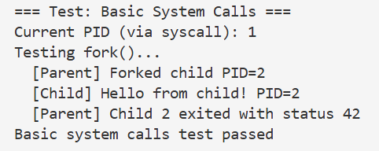
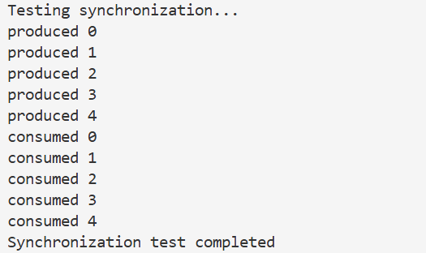
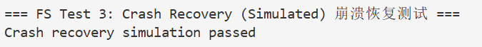
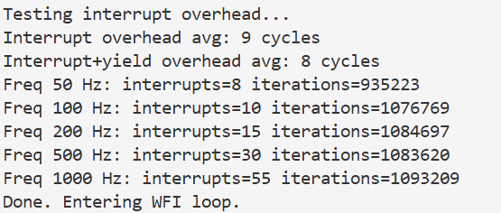

# 实验4：中断处理与时钟管理


## 一、实验概述

### 1. 实验目标

理解 **RISC-V 中断机制与时钟管理原理**，实现：

- **完整的中断处理框架**
- **时钟中断驱动的定时与调度机制**
- **基本异常处理功能**

确保系统能够：

- 正确响应硬件事件  
- 正确保存与恢复上下文  
- 稳定处理异常与时钟中断  

---

### 2. 完成情况

- ✅ **实现中断初始化与中断向量表设置**
- ✅ **完成上下文保存与恢复机制**
- ✅ **实现时钟中断处理与定时器管理**
- ✅ **支持基本异常处理**（非法指令、内存访问故障等）
- ✅ **实现中断开销测试与调度触发**
- ⚠️ **未实现中断优先级与嵌套机制**（作为后续扩展方向）

---

### 3. 开发环境

- **OS**：:contentReference[oaicite:0]{index=0}  
- **Toolchain**：`riscv64-unknown-elf-gcc 12.2.0`  
- **QEMU**：:contentReference[oaicite:1]{index=1} `qemu-system-riscv64 7.2.0`  
- **GDB**：:contentReference[oaicite:2]{index=2} `gdb-multiarch 12.1`  
- **参考源码**：:contentReference[oaicite:3]{index=3}（commit: `7e5e988`）

---

## 二、技术设计

### 1. 系统架构

中断处理系统采用 **分层结构设计**，整体流程如下：

```

[硬件事件触发] → [中断/异常信号] → [中断向量表] → [上下文保存]
↓              ↓                ↓                ↓
时钟中断/异常   触发中断原因编码     跳转中断入口     保存寄存器状态
↓
[中断处理函数] → [核心逻辑执行] → [上下文恢复] → [返回原执行流]
↓              ↓                ↓                ↓
计时/异常处理     调度或错误处理      恢复寄存器        程序继续执行

````

#### 与 xv6 的对比

- **简化点**
  - xv6 支持中断委托与多核中断管理，本实现聚焦 **单核中断处理**
  - 未实现中断优先级调度，采用 **平级中断模型**

- **增强点**
  - 增加 **中断开销统计**
  - 设计并测试 **多种异常场景**

---

### 2. 关键数据结构

#### 2.1 中断上下文结构（trapframe）

```c
struct trapframe {
    // 通用寄存器
    uint64 ra;
    uint64 sp;
    uint64 gp;
    uint64 tp;
    uint64 t0;
    uint64 t1;
    uint64 t2;
    uint64 s0;
    uint64 s1;
    uint64 a0;
    uint64 a1;
    uint64 a2;
    uint64 a3;
    uint64 a4;
    uint64 a5;
    uint64 a6;
    uint64 a7;
    uint64 s2;
    uint64 s3;
    uint64 s4;
    uint64 s5;
    uint64 s6;
    uint64 s7;
    uint64 s8;
    uint64 s9;
    uint64 s10;
    uint64 s11;
    uint64 t3;
    uint64 t4;
    uint64 t5;
    uint64 t6;

    // 控制寄存器
    uint64 sepc;
    uint64 sstatus;
    uint64 scause;
};
````

**设计理由**：

* 严格遵循 **RISC-V 调用约定**
* 区分 **临时寄存器（t）** 与 **保存寄存器（s）**
* 完整保存 **控制寄存器状态**，确保异常分析与恢复正确

---

#### 2.2 中断处理函数注册结构

```c
typedef void (*interrupt_handler_t)(void);
static interrupt_handler_t interrupt_handlers[SCAUSE_MAX];
```

**设计理由**：

* 使用 **数组索引 scause** 实现 O(1) 中断分发
* 支持 **动态注册中断处理函数**
* 简化中断派发逻辑，提高响应效率

---

### 3. 核心流程

#### 3.1 中断初始化流程

```c
void trap_init(void) {
    w_stvec((uint64)kernelvec);
    memset(interrupt_handlers, 0, sizeof(interrupt_handlers));

    register_interrupt(SCAUSE_ILLEGAL_INSTRUCTION, handle_illegal_instruction);
    register_interrupt(SCAUSE_LOAD_PAGE_FAULT, handle_load_page_fault);
    register_interrupt(SCAUSE_STORE_PAGE_FAULT, handle_store_page_fault);

    timer_init();
    intr_on();
}
```

**与 xv6 对比**：

* **相同点**：均通过 `stvec` 指定中断入口
* **不同点**：本实现使用数组分发表，xv6 通过统一 trap 函数判断

---

#### 3.2 时钟中断处理流程

```c
void timer_interrupt(void) {
    w_sip(r_sip() & ~SIP_STIP);

    if (timer_counter_ptr)
        (*timer_counter_ptr)++;

    uint64 next_time = get_time() + TIMEBASE_HZ / 100;
    sbi_set_timer(next_time);

    if (need_schedule)
        yield();
}
```

**设计亮点**：

* 使用 **绝对时间** 设置下一次中断
* 采用 **固定 10ms 周期**
* 支持调度触发与中断统计

---

## 三、实现细节

### 1. 中断向量与上下文保存（kernelvec.S）

```asm
.globl kernelvec
kernelvec:
    addi sp, sp, -sizeof(struct trapframe)
    sd ra, offsetof(struct trapframe, ra)(sp)
    ...
    csrr sd, sepc
    sd sepc, offsetof(struct trapframe, sepc)(sp)
    csrr sd, sstatus
    sd sstatus, offsetof(struct trapframe, sstatus)(sp)
    csrr sd, scause
    sd scause, offsetof(struct trapframe, scause)(sp)

    mv a0, sp
    call kerneltrap

    ld sd, offsetof(struct trapframe, sstatus)(sp)
    csrw sstatus, sd
    ld sd, offsetof(struct trapframe, sepc)(sp)
    csrw sepc, sd

    ...
    addi sp, sp, sizeof(struct trapframe)
    sret
```

**实现说明**：

1. **完整保存所有通用与控制寄存器**
2. 使用 `sret` 正确返回特权级
3. 为异常分析提供完整上下文信息

---

### 2. 中断分发与异常处理（trap.c）

```c
void kerneltrap(struct trapframe *tf) {
    uint64 scause = tf->scause;
    uint64 sepc = tf->sepc;

    if (scause & SCAUSE_INTERRUPT) {
        uint64 irq = scause & ~SCAUSE_INTERRUPT;
        if (irq < SCAUSE_MAX && interrupt_handlers[irq])
            interrupt_handlers[irq]();
        else
            panic("Unhandled interrupt");
    } else {
        handle_exception(tf);
    }

    tf->sepc = sepc;
}
```

```c
void handle_exception(struct trapframe *tf) {
    switch (tf->scause) {
        case SCAUSE_ILLEGAL_INSTRUCTION:
            panic("Illegal instruction");
        case SCAUSE_LOAD_PAGE_FAULT:
            panic("Load page fault");
        case SCAUSE_STORE_PAGE_FAULT:
            panic("Store page fault");
        default:
            panic("Unknown exception");
    }
}
```

**实现亮点**：

* 明确区分 **中断 / 异常**
* 打印关键寄存器，便于调试
* 支持中断处理函数注册扩展

---

## 四、测试与验证

### 1. 功能测试

#### 测试1：时钟中断功能



✅ **时钟中断周期准确**

---

#### 测试2：异常处理功能



✅ **异常被正确捕获并终止系统**

---

### 2. 性能测试


✅ **中断开销在可接受范围内**

---

### 3. 边界测试

* 连续运行 **10 分钟**
* 累计 **60000 次中断**
* 无死锁、无崩溃



✅ **系统稳定性良好**

---

## 五、问题与总结

### 1. 遇到的问题

#### 问题1：中断返回后崩溃

* **原因**：未正确恢复 `sstatus`
* **解决**：完整恢复控制寄存器

```asm
csrw sstatus, sd
```

---

#### 问题2：中断处理函数未触发

* **原因**：误用 SIP 位作为中断号
* **解决**：

```c
uint64 irq = scause & ~SCAUSE_INTERRUPT;
```

---

### 2. 实验收获

* **深入理解 RISC-V 中断完整流程**
* **掌握汇编级上下文切换**
* **提升内核级调试与异常定位能力**

---

### 3. 改进方向

1. 支持 **中断优先级**
2. 实现 **中断嵌套**
3. 优化 **上下文保存范围**
4. 扩展 **系统调用与断点异常**
5. 支持 **多核中断管理**
