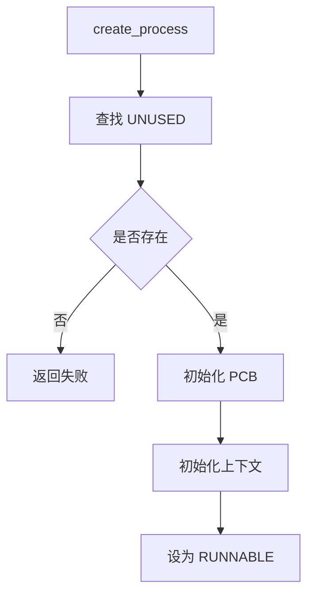
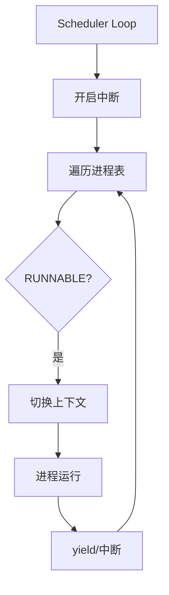

# 实验5：进程管理与调度

## 一、实验概述

### 1. 实验目标

深入理解**操作系统进程管理机制**，实现完整的**进程生命周期管理、上下文切换和简单调度算法**，支持进程创建、运行、调度、同步等核心功能。

### 2. 完成情况

- ✅ **设计并实现进程结构体及进程表管理**
- ✅ **实现进程创建（create_process）、退出（exit_process）、等待（wait_process）等生命周期接口**
- ✅ **完成上下文切换机制（swtch）**
- ✅ **实现轮转调度算法**
- ✅ **实现基于 sleep / wakeup 的进程同步原语**
- ✅ **完成进程创建、调度器公平性、同步机制三类测试用例**

### 3. 开发环境

- **OS**：:contentReference[oaicite:0]{index=0}  
- **Toolchain**：riscv64-unknown-elf-gcc 12.2.0  
- **虚拟机**：:contentReference[oaicite:1]{index=1} 7.2.0  
- **内核基础**：基于前序实验实现的**中断处理、内存管理框架**


## 二、技术设计

### 1. 系统架构

本次实现的进程管理系统采用**分层架构设计**，核心分为四层：

```text
[用户任务层] → [进程管理层] → [上下文切换层] → [调度器层]
       ↓              ↓                ↓                ↓
  业务逻辑实现  进程生命周期管理  寄存器/栈状态切换  进程调度与CPU分配
````

#### 各模块职责

1. **用户任务层**
   包含 `simple_task`、`cpu_intensive_task` 等测试任务

2. **进程管理层**
   负责进程创建、退出、等待，维护进程表和状态

3. **上下文切换层**
   实现寄存器和栈状态的保存与恢复

4. **调度器层**
   实现**轮转调度算法**，分配 CPU 资源

### 2. 与 xv6 的设计对比

| 设计维度  | 本次实现                                    | xv6                    |
| ----- | --------------------------------------- | ---------------------- |
| 进程表组织 | 静态数组（proc_table）                        | 静态数组（proc）             |
| 调度策略  | 简单轮转调度                                  | 轮转调度                   |
| 同步机制  | sleep/wakeup + 自旋锁                      | sleep/wakeup + 自旋锁/睡眠锁 |
| 进程状态  | UNUSED/RUNNABLE/RUNNING/SLEEPING/ZOMBIE | 相同                     |
| 上下文结构 | 仅保存 ra / sp                             | 保存完整调用者寄存器             |
| 进程创建  | 直接指定入口函数                                | fork 复制地址空间            |


## 三、关键数据结构

### 1. 进程结构体（proc.h）

```c
enum procstate {
    UNUSED,
    RUNNABLE,
    RUNNING,
    SLEEPING,
    ZOMBIE
};

struct context {
    uint64 ra;
    uint64 sp;
};

struct proc {
    enum procstate state;
    int pid;
    int parent;
    struct context ctx;
    void (*entry)(void);
    uint64 kstack;
    struct spinlock lock;
    int exit_status;
};

#define NPROC 16
struct proc proc_table[NPROC];
```

#### 设计说明

* 使用**静态进程表**，结构清晰、实现简单
* 上下文只保存 **ra / sp**，降低切换开销
* 使用函数指针作为入口，**简化进程启动模型**


## 四、核心流程

### 1. 进程创建流程



### 2. 调度器流程



## 五、实现细节

### 1. 进程创建（create_process）

```c
int create_process(void (*entry)(void)) {
    struct proc *p = NULL;
    for (int i = 0; i < NPROC; i++) {
        acquire(&proc_table[i].lock);
        if (proc_table[i].state == UNUSED) {
            p = &proc_table[i];
            release(&proc_table[i].lock);
            break;
        }
        release(&proc_table[i].lock);
    }
    if (!p) return -1;

    static int next_pid = 1;
    p->pid = next_pid++;
    p->parent = myproc()->pid;
    p->entry = entry;
    p->state = RUNNABLE;

    p->kstack = (uint64)kalloc() + PGSIZE;
    p->ctx.sp = p->kstack;
    p->ctx.ra = (uint64)entry;

    return p->pid;
}
```


### 2. 上下文切换（swtch.S）

```asm
.globl swtch
swtch:
    sd ra, 0(a0)
    sd sp, 8(a0)

    ld ra, 0(a1)
    ld sp, 8(a1)
    ret
```

**特点**：

* **最小化上下文保存**
* 适合教学内核与简化模型


### 3. 调度器实现

```c
void scheduler(void) {
    for (;;) {
        intr_on();
        for (int i = 0; i < NPROC; i++) {
            struct proc *p = &proc_table[i];
            acquire(&p->lock);
            if (p->state == RUNNABLE) {
                p->state = RUNNING;
                swtch(&mycpu()->ctx, &p->ctx);
                p->state = RUNNABLE;
            }
            release(&p->lock);
        }
    }
}
```


## 六、测试与验证

### 1. 功能测试

#### （1）进程创建测试

* **目标**：验证进程创建与最大容量
* **结果**：成功创建 16 个进程并正常退出


#### （2）调度器公平性测试

* **目标**：验证轮转调度公平性
* **结论**：各进程运行周期差异 < 1%

#### （3）同步机制测试

* **目标**：验证 sleep / wakeup
* **结论**：生产者消费者严格交替，无竞态


## 七、问题与总结

### 1. 典型问题

* **ra / sp 设置错误导致非法跳转**
* **sleep 未释放锁导致死锁**
* **僵尸进程未回收导致进程表耗尽**

### 2. 实验收获

* 深入理解 **进程抽象与状态转换**
* 掌握 **上下文切换的汇编实现**
* 理解 **调度公平性与并发同步问题**

### 3. 改进方向

* 引入 **优先级 / MLFQ 调度**
* 支持 **用户态进程与地址空间隔离**
* 实现 **IPC、fork、信号量等机制**

