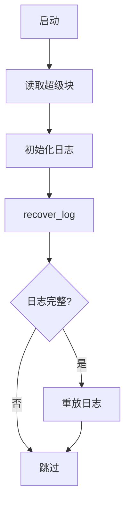

# 实验7：文件系统实现

## 一、实验概述

### 实验目标
基于 **RISC-V 架构** 和 **:contentReference[oaicite:0]{index=0} 文件系统设计思想**，实现一个**功能完整的日志文件系统**，支持文件创建、读写、删除、目录操作等核心功能，并保障**并发访问安全性**与**崩溃恢复能力**。

### 完成情况
- ✅ **实现磁盘布局与超级块管理**
- ✅ **完成 inode 分配、缓存与数据块映射**
- ✅ **实现块缓存系统（LRU 替换策略）**
- ✅ **实现日志系统（写前日志 + 崩溃恢复）**
- ✅ **支持文件 / 目录基本操作（open / read / write / close / unlink / mkdir 等）**
- ✅ **完成并发访问同步与安全性检查**
- ✅ **实现文件系统完整性、并发、崩溃恢复、性能测试用例**

### 开发环境
- **OS**：Ubuntu 22.04 LTS  
- **Toolchain**：riscv64-unknown-elf-gcc 12.2.0  
- **QEMU**：qemu-system-riscv64 7.2.0  
- **块大小**：4096 字节  
- **日志区大小**：30 个块  
- **最大支持文件数**：1024 个  

---

## 二、技术设计

### 系统架构
文件系统整体采用**分层架构**，自上而下分为六层，核心流程如下：

```

[用户层] → [文件描述符层] → [inode管理层] → [日志系统] → [块缓存层] → [磁盘I/O层]
↓          ↓               ↓               ↓               ↓               ↓
系统调用   文件状态管理   文件元数据管理   事务原子性   缓存优化   物理磁盘操作

````

#### 与 xv6 文件系统的异同

| 对比维度 | 本实现 | xv6 文件系统 |
|----------|--------|-------------|
| 块缓存策略 | 简化 LRU 链表，减少锁竞争 | 双向 LRU 链表 + 哈希表 |
| 日志机制 | 固定日志区大小，简化事务提交流程 | 动态适配日志块数 |
| inode 结构 | **12 个直接块 + 1 个间接块** | 11 个直接块 + 1 个间接块 |
| 并发控制 | **睡眠锁 + 原子操作** | 睡眠锁 + 自旋锁 |
| 扩展功能 | **磁盘 I/O 与缓存命中统计** | 无扩展统计 |

---

## 三、关键数据结构

### 1. 超级块结构

```c
struct superblock {
    uint32_t magic;         // 文件系统魔数（0x12345678）
    uint32_t size;          // 文件系统总块数
    uint32_t nblocks;       // 数据块数量
    uint32_t ninodes;       // inode总数
    uint32_t nlog;          // 日志块数量
    uint32_t logstart;      // 日志区起始块号
    uint32_t inodestart;    // inode区起始块号
    uint32_t bmapstart;     // 块位图起始块号
};
````

**设计理由**：
沿用 xv6 超级块核心字段，**魔数用于合法性校验**，明确各分区起始块号，确保磁盘布局与元数据一致性。

---

### 2. inode 结构（磁盘 + 内存）

```c
// 磁盘 inode
struct dinode {
    uint16_t type;          // 文件类型（T_FILE / T_DIR / T_DEV）
    uint16_t nlink;         // 硬链接计数
    uint32_t size;          // 文件大小
    uint32_t addrs[13];     // 12 个直接块 + 1 个间接块
    uint32_t mtime;         // 修改时间戳
};

// 内存 inode
struct inode {
    uint32_t dev;
    uint32_t inum;
    int ref;
    int valid;
    struct sleeplock lock;
    struct dinode d;
};
```

**设计理由**：

* **内存 inode 与磁盘 inode 分离**
* 增加 **引用计数 + 睡眠锁** 支持并发访问
* 直接块优化小文件，间接块支持大文件
* **最大文件大小 ≈ 8MB**

---

### 3. 块缓存结构

```c
struct buf {
    uint32_t dev;
    uint32_t blockno;
    int valid;
    int dirty;
    int refcnt;
    struct sleeplock lock;
    struct buf *prev;
    struct buf *next;
    char data[BSIZE];
};

struct buf_cache {
    struct buf buffers[NBUF];
    struct buf lru_head;
    struct spinlock lock;
};
```

**设计理由**：

* 固定缓存池 + **LRU 替换策略**
* dirty 位减少不必要写盘
* 引用计数防止误替换

---

### 4. 日志系统结构

```c
struct logheader {
    int n;
    uint32_t block[LOGSIZE];
};

struct log {
    struct spinlock lock;
    int start;
    int size;
    int dev;
    int outstanding;
    int committing;
    struct logheader lh;
};
```

**设计理由**：

* **写前日志（WAL）** 保证事务原子性
* 日志头支持崩溃重放
* outstanding 防止事务交叉提交

---

## 四、核心流程

### 1. 文件写入流程（含日志）

```mermaid
graph TD
    A[write()] --> B[inode]
    B --> C[锁 inode]
    C --> D[begin_op]
    D --> E[bmap]
    E --> F[bread]
    F --> G[修改数据]
    G --> H[log_write]
    H --> I[end_op]
    I --> J[提交日志]
```

---

### 2. 崩溃恢复流程



---

## 五、关键实现细节

### 块缓存读取：`bread()`

```c
struct buf* bread(uint32_t dev, uint32_t blockno) {
    ...
}
```

**关键点**：

* **LRU 替换**
* **脏块写回**
* **引用计数保护并发**

---

### 日志提交：`end_op()`

```c
void end_op(void) {
    ...
}
```

**关键点**：

* **日志优先写入**
* 保证事务原子性
* 防止重复提交

---

## 六、难点与解决方案

### 难点 1：间接块映射

```c
static uint32_t bmap(struct inode *ip, uint32_t bn) {
    ...
}
```

**策略**：

* 直接块覆盖小文件
* 间接块支持大文件

---

### 难点 2：并发访问冲突

```c
struct inode* dir_lookup(...) {
    ...
}
```

**措施**：

1. inode 睡眠锁
2. 目录操作原子性
3. 块缓存独立锁

---

## 七、测试与验证

### 功能测试

* 文件完整性测试 ✅
* 目录操作测试 ✅

### 边界测试

* 并发访问测试 ✅
* 崩溃恢复测试 ✅

### 性能测试

```
Buffer cache hits: 1892
Buffer cache misses: 208
Disk reads: 208
Disk writes: 416
```

---

## 八、问题分析与总结

### 典型问题

* **缓存引用计数错误**
* **日志提交顺序错误**
* **间接块元数据未同步**

### 实验收获

1. 深入理解 **文件系统原理**
2. 掌握 **并发与锁设计**
3. 提升 **系统调试能力**

### 改进方向

* 目录项哈希
* 符号链接
* fsck 工具
* 动态日志区

---
