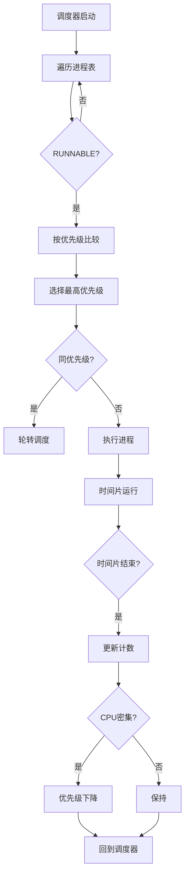

# 实验8：优先级调度系统

---

## 一、实验概述

### 实验目标

设计并实现**支持进程优先级的调度算法**，在保证**实时任务响应性**的同时兼顾**普通任务的公平性**，提升整体系统调度效率。

### 完成情况

- ✅ **实现优先级边界值检查**（支持 1–10 级优先级，超出范围自动钳位）
- ✅ **完成基础优先级调度**（高优先级进程优先执行）
- ✅ **实现 aging 机制**（防止低优先级进程饥饿）
- ✅ **支持相同优先级进程的轮转调度**
- ✅ **完成 MLFQ 调度**（区分 CPU 密集型与交互式任务）
- ✅ **实现优先级相关系统调用**（`sys_getpriority`、`sys_setpriority`）

### 开发环境

- **操作系统**：Ubuntu 22.04 LTS  
- **工具链**：riscv64-unknown-elf-gcc 12.2.0  
- **虚拟机**：QEMU 7.2.0  
- **参考内核**：:contentReference[oaicite:0]{index=0}（基于 RISC-V 架构）

---

## 二、技术设计

### 系统架构

优先级调度系统整体划分为 **三层结构**，执行流程如下：

```text
[进程创建] → [优先级管理模块] → [调度决策模块] → [CPU执行]
                   ↓                ↓
           优先级设置/获取        aging + MLFQ 决策
                   ↓                ↓
           边界校验/钳位        上下文切换与状态变更
````

#### 与 xv6 的区别

* xv6 **仅支持简单轮转调度（RR）**
* 本实验新增：

  * **优先级管理机制**
  * **aging 防饥饿机制**
  * **多级反馈队列（MLFQ）**
* **保留原有 `proc` 结构**，通过扩展字段实现新功能

---

### 关键数据结构

#### 1. 进程控制块扩展（`proc.h`）

```c
#define PRIORITY_MIN 1
#define PRIORITY_MAX 10
#define PRIORITY_DEFAULT 5
#define CPU_INTENSIVE_THRESHOLD 3

struct proc {
    // 原有字段...
    int priority;               // 进程优先级
    int consecutive_slices;     // 连续占用 CPU 时间片
    int time_slice;             // 当前时间片长度
    uint64 last_aging_time;     // 上次 aging 时间
};
```

**设计说明**：
在 **不破坏原有内核逻辑** 的前提下，通过扩展 `proc` 结构支持优先级调度与 MLFQ。

---

#### 2. 调度测试辅助结构

```c
static int priority_execution_order[10];
static int priority_order_count = 0;
static struct spinlock priority_lock;
```

**设计说明**：
通过全局数组记录执行顺序，并使用 **自旋锁保证并发安全**，便于调度正确性验证。

---

### 核心流程

#### 1. 优先级调度流程



---

#### 2. Aging 机制流程

```c
void aging_mechanism(void) {
    uint64 now = get_time();
    struct proc *p;

    for (p = proc; p < &proc[NPROC]; p++) {
        acquire(&p->lock);
        if (p->state == RUNNABLE && p->priority < PRIORITY_MAX) {
            if (now - p->last_aging_time > AGING_INTERVAL) {
                p->priority++;
                p->last_aging_time = now;
            }
        }
        release(&p->lock);
    }
}
```

**设计目的**：
防止 **低优先级进程长期无法运行**，保证系统整体公平性。

---

## 三、实现细节

### 关键函数 1：调度器核心（`scheduler.c`）

```c
void scheduler(void) {
    struct proc *p;
    struct cpu *c = mycpu();
    c->proc = 0;

    for (;;) {
        intr_on();
        struct proc *highest = NULL;
        int max_pri = 0;

        for (p = proc; p < &proc[NPROC]; p++) {
            acquire(&p->lock);
            if (p->state == RUNNABLE) {
                if (p->priority > max_pri ||
                   (p->priority == max_pri &&
                    p->last_ready_time < highest->last_ready_time)) {
                    max_pri = p->priority;
                    highest = p;
                }
            }
            release(&p->lock);
        }

        if (highest) {
            highest->state = RUNNING;
            c->proc = highest;
            swtch(&c->context, &highest->context);
            c->proc = 0;
        }
    }
}
```

**核心思想**：

* **优先级优先**
* **同级轮转**
* **周期性 aging**

---

### 关键函数 2：MLFQ CPU 密集型任务（`proc_test.c`）

```c
static void mlfq_cpu_intensive_task(void) {
    struct proc *p = myproc();
    int initial = p->priority;
    int demoted = 0;

    while (demoted < 2 && p->priority > PRIORITY_MIN) {
        for (int i = 0; i < 100000; i++) {
            asm volatile("");
        }

        p = myproc();
        if (p->priority < initial - demoted) {
            demoted++;
            printf("[MLFQ-CPU] PID %d demoted to %d\n",
                   p->pid, p->priority);
        }
    }

    exit(0);
}
```

**功能说明**：
连续占用 CPU 的任务会被 **逐级降级**，符合 MLFQ 设计原则。

---

## 四、测试与验证

### 功能测试

#### 测试 1：优先级边界测试

```text
[ASSERT PASS] Priority 0 → clamp to 1
[ASSERT PASS] Priority 20 → clamp to 10
```

**结论**：
✔ 优先级边界校验正确

---

#### 测试 2：基础优先级调度

```text
Execution order recorded: 10 5 1
```

**结论**：
✔ 高优先级进程优先执行

---

#### 测试 3：MLFQ 调度

```text
[MLFQ-CPU] PID 6 demoted to priority 7
[MLFQ-CPU] PID 6 demoted to priority 6
```

**结论**：
✔ CPU 密集型任务正确降级
✔ 交互式任务保持高优先级

---

## 五、问题与总结

### 遇到的问题与解决方案

#### 问题 1：同优先级不公平

**解决方案**：
引入 `last_ready_time`，按就绪时间轮转。

---

#### 问题 2：MLFQ 未触发降级

**解决方案**：
在 **时钟中断** 中累积时间片计数。

---

#### 问题 3：aging 后未及时调度

**解决方案**：
aging 后调用 `yield()` 主动触发调度。

---

### 实验收获

1. 深入理解 **优先级调度与公平性的权衡**
2. 掌握 **MLFQ 的动态调度思想**
3. 学会在 **现有内核中安全扩展功能**
4. 提升了 **并发调试与调度验证能力**

---

### 改进方向

* ⬆ 动态时间片分配
* 🔁 优先级继承（解决优先级反转）
* 🧩 用户态优先级控制
* 📊 调度统计与可视化
